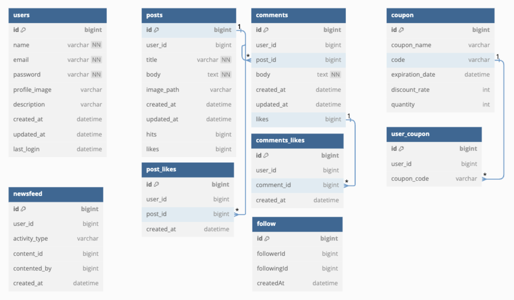

# 쿠폰 서비스
커뮤니티와 실시간 쿠폰 발급이 결합된 서비스입니다

## Skills 

 
  
  
   
  
  
  
   
  
  
   
  
  
   
  
  
   

## Modules
- 서비스를 클릭하면 해당 서비스 레포지토리로 이동합니다.

| Service	                                                                          | Description	                               | Authorization	 | Port |
|:----------------------------------------------------------------------------------|:-------------------------------------------|:---------------|:-----|
| [`Gateway`](https://github.com/Reservation-Purchase-System/api-gateway.git)   | 요청을 적절한 서비스로 라우팅                 | jwt 토큰으로 권한 검사 | `8000` |
| [`User`](https://github.com/JiHyeong23/CouponProject/tree/main/UserService)         | 사용자 관련 서비스 | jwt 토큰으로 권한 검사 | `8080` |
| [`Activity`](https://github.com/JiHyeong23/CouponProject/tree/main/ActivityService)  | 활동 관련 서비스    |                | `8081` |
| [`NewsFeed`](https://github.com/JiHyeong23/CouponProject/tree/main/NewsFeedService) | 뉴스피드 관련 서비스   |                | `8082` |
| [`Shop`](https://github.com/Reservation-Purchase-System/payment-service.git)   | 쿠폰 관련 서비스    |                | `8083` |
| [`Discovery`](https://github.com/JiHyeong23/CouponProject/tree/main/DiscorveryService)             | 서비스 등록 및 검색      | | `8761` |

## ERD

